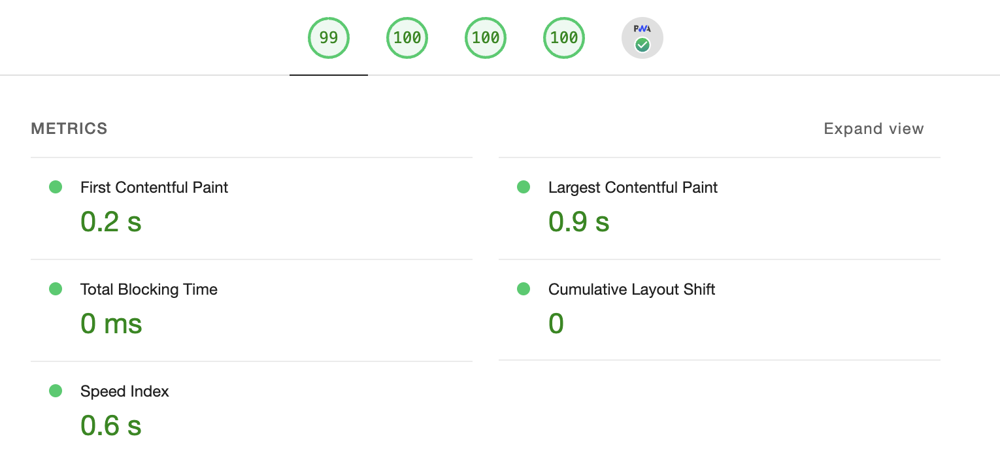
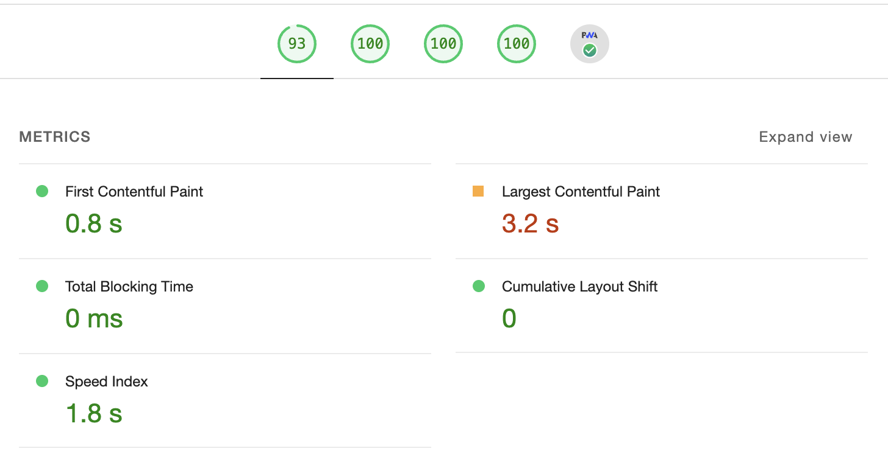

# Results

Hey there, person who will check this!

Unfortunately, I couldn't do everything task requires, but I tried my best for two weekend days.

Hope you have a nice day!

## Check-list

✅ **Document** solutions

✅ Set up **TypeScript** and finish the app using TS.

✅ Prepare and send us your solution as a **GitHub repository** with a **PR with all the changes**.

✅ Replace the dummy app data with **real weather data**.

✅ Update the background of the app to **show different gradients** based on the user's **local time**.

✅ The “Hourly Forecast” section have a **scrollable list**.

✅ The “10-Day Forecast” section have columns that **form a straight line**.

✅ Use more best practices and fix existing issues.

✅ Improve the current location detection.

✅ [Optional] Handle any network errors **gracefully** to prevent “data flashing” on the screen.

✅ [Optional] Make the app “installable”.

❌ [Optional] ...and **work offline** (too much effort, sorry).

❌ [Optional] Adapt the UI for **wider screens** (not sure there's something to adapt – these are just three blocks which are not really "movable" in an appealing way, but maybe I misunderstood something).

❌ Ensure that the app is performant by **measuring** web vitals (I've had time only to run Lighthouse in Chrome, see results below).

## Web Vitals

I am not sure that an app like this could have a poor performance, but anyway, that's results:

Desktop:

Mobile:

(there are low LCP results because of the slow API response)

## Solutions

I am not sure I've got "documenting decisions" right because, really, I just tried to keep everything as simple as possible. So I'll just write a short sum up:

Developer Experience:

1. Installed and configured `eslint`, `stylelint` and `prettier` – these are must.
1. Added auto ordering and grouping for css files and for imports in ts files.
1. Used exact versions on packages. In my humble opinion it's more predictable and controllable.
1. Set strict `node.js` and `npm` versions requirements and added `.nvmrc` file to add a little bit of comfort.

Code:

1. Extracted `WeatherScreen` in a "module" to keep everything in one place.
1. Sliced layers a little bit: separated API, data-adapting, presentation for `WeatherScreen` and keep some reusable base components on app level.
1. Used CSS-modules as the simplest solutions for such a small project, overall kept codebase simple by delivering it from state managers, excess libraries and useless patterns.
1. Used Intl localization mechanisms where it is possible to keep it simple, but localized a little bit.
1. Added a small portion of complexity in `Panel` dot-component. I, personally, think that these components are a lot easier to read and use, that props-driven.
1. Added all required basic PWA content: manifest, icons, empty `ServiceWorker`. App is installable for Android and iOS phones (that's all what I could test).
1. There are some local `Note:` comments in the codebase adding some context on code.
1. Took care of a11y by using HTML-semantics and visually-hidden content.
1. Made two ways of detecting user's location – by browser API, and by request, if user blocks Geolocation API.

## Feedback on the assignment itself

Overall the task is great – it was interesting to reverse engineer Apple Weather ;D

But there are some negative things, I wanted to highlight:

- Gradients in Figma are really bad, I just couldn't do anything with panels styling to look good above morning and evening gradients. Moreover, they have rgba colors, with some background color of te shape itself. Please, make them more clean for the future candidates.
- There are not enough icons to use for weather conditions, I spend a lot of time trying to find something beautiful online. So, I just ended up using PNG (!) icons with inconsistent contrast (!!) as base64 (!!!). It would be great to have ready-to-use icons set.
- Offline mode using pseudo-CRA is too much. I'd say it would be better to add some more panels / modules to work with (and it lead to the wide-screens adaptation more, than now).
